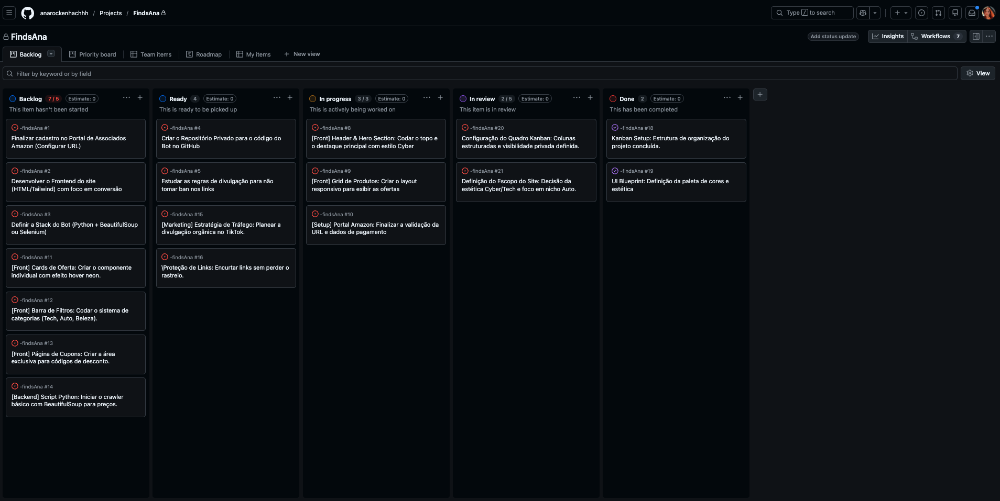

# 🛍️ Achadinhos da Ana

### *Curadoria inteligente de ofertas em tempo real*

[🔗 Ver Protótipo no Figma](https://www.figma.com/make/Us7vfXZYOlT8EHE1hqey5k/Achadinhos-da-Ana-website?t=lZ1m0c5uXoJ8USGs-0)

---

## 📌 Sobre o Projeto

**Achadinhos da Ana** é uma plataforma full stack de curadoria automatizada de ofertas que monitora e centraliza as melhores promoções das maiores lojas do Brasil — em tempo real.

Não é apenas um site estático: é um ecossistema completo com bot de mineração, banco de dados reativo e interface otimizada para conversão.

> 💡 **Lojas monitoradas:** Amazon · Mercado Livre · Shopee · KaBuM!

---

## ⚙️ Como Funciona

1. **Mineração** — O bot acessa as plataformas parceiras, identifica promoções e extrai os dados relevantes.
2. **Armazenamento** — As ofertas são salvas e atualizadas no Supabase em tempo real.
3. **Exibição** — A interface consome os dados e os apresenta de forma limpa e responsiva ao usuário final.

---

## 🚀 Funcionalidades

- [x] 🤖 **Web Scraping automatizado** com Selenium + BeautifulSoup
- [x] ⚡ **Atualização em tempo real** via Supabase Realtime
- [x] 📱 **Layout responsivo** com abordagem Mobile First
- [x] 🔍 **Filtro inteligente** por categoria e loja
- [x] 🏷️ **Cards de oferta** com percentual de desconto e preço atual
- [ ] 🔔 Notificações por e-mail/Telegram *(em breve)*
- [ ] 📊 Histórico de preços *(em breve)*

---

## 🛠️ Stack Tecnológica

| Camada | Tecnologias |
|--------|-------------|
| **Front-end** | HTML5, CSS3, JavaScript ES6+, Tailwind CSS |
| **Automação / Back-end** | Python, Selenium, BeautifulSoup |
| **Banco de Dados** | Supabase (PostgreSQL + Realtime) |
| **Design** | Figma |
| **Gestão** | Kanban |

---

## 🎨 Design & Processo

O projeto seguiu um fluxo rigoroso de desenvolvimento:

- **Planejamento:** Tarefas organizadas em quadro Kanban para gestão ágil do progresso.
- **Prototipagem:** Design de alta fidelidade criado no Figma com foco em UX, estética premium e taxa de conversão.
- **Desenvolvimento:** Implementação fiel ao protótipo com componentização e boas práticas.

📐 [Acessar protótipo no Figma](https://www.figma.com/make/Us7vfXZYOlT8EHE1hqey5k/Achadinhos-da-Ana-website?t=lZ1m0c5uXoJ8USGs-0)

---

## 🤝 Contribuindo

Contribuições são bem-vindas! Sinta-se à vontade para abrir uma *issue* ou enviar um *pull request*.

---

Feito com ❤️ por <a href="https://github.com/anarockenhachhh">Ana</a>

